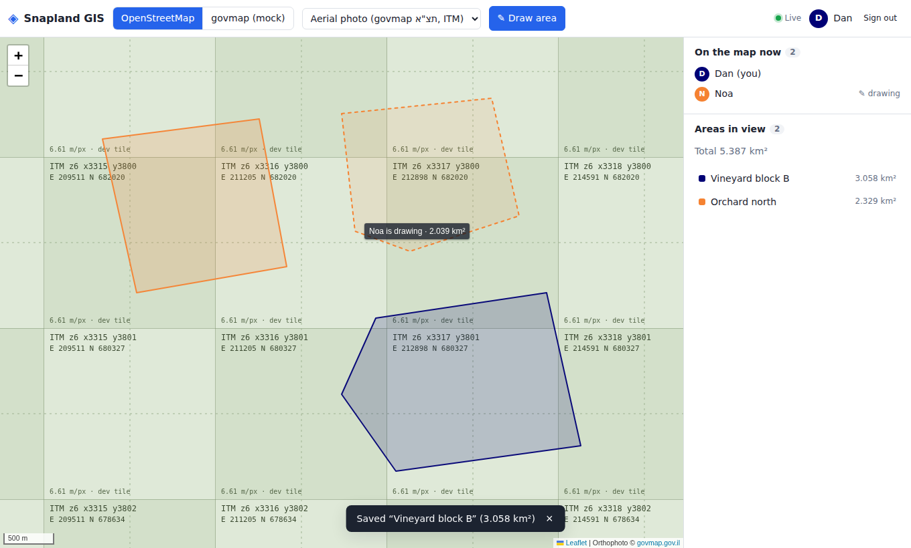
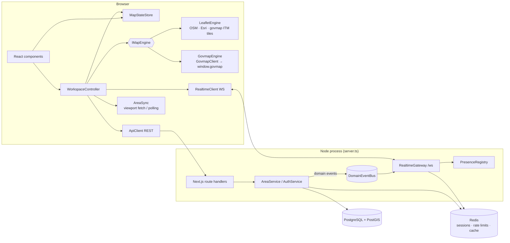

# Snapland GIS

A collaborative, real-time GIS web app. Several people draw and measure areas on the same map at once. They can switch between a regular map and aerial imagery, and between the **govmap.gov.il** map and **Leaflet/OpenStreetMap**.



*Dan's view: Noa is drawing (dashed outline and live km² label) while their saved areas render in each owner's colour. The base layer is the ITM-grid orthophoto layer, shown here with the development tile stand-in.*

## Contents

1. [Features](#features)
2. [Quick start (Docker)](#quick-start-docker)
3. [Local development](#local-development)
4. [Configuration](#configuration)
5. [govmap token](#govmap-token)
6. [Architecture](#architecture)
7. [Technical decisions](#technical-decisions)
8. [Database design](#database-design)
9. [API](#api)
10. [Real-time protocol](#real-time-protocol)
11. [Map projections and area accuracy](#map-projections-and-area-accuracy)
12. [Performance](#performance)
13. [Security](#security)
14. [Observability](#observability)
15. [Scaling to multiple instances](#scaling-to-multiple-instances)
16. [Testing](#testing)
17. [govmap: things to verify with a real token](#govmap-things-to-verify-with-a-real-token)
18. [Known limitations](#known-limitations)
19. [Future improvements](#future-improvements)
20. [Project structure](#project-structure)

## Features

**Accounts**
- Register, sign in and sign out.
- Server-side sessions in Redis behind an httpOnly cookie.

**Two map engines, switchable at runtime** without losing the view, the selection or your shapes:
- **govmap:** a typed TypeScript wrapper over the govmap.gov.il JavaScript API, with drawing (`govmap.draw`) and the govmap street and orthophoto (תצ"א) backgrounds.
- **Leaflet:** OpenStreetMap, satellite imagery (Esri World Imagery), and govmap orthophoto tiles in the Israeli TM grid. Switching to the ITM layer re-projects the map and keeps shapes in place.

**Drawing**
- Polygon drawing with a live geodesic area (km² on the WGS84 ellipsoid) as you place points.
- Vertex editing on Leaflet; redraw on govmap.

**Collaboration**
- Everyone sees everything live: other users' in-progress sketches, saved and edited areas, and who is online, drawing or editing.
- **Ownership:** every area has an owner. Anyone can edit it, but only the owner can delete or restore it.
- **Versioning and conflict resolution:** every change is versioned with full edit history. Stale writes get a conflict dialog ("keep theirs" or "apply mine on top").

**Protection and reliability**
- Rate limiting: 50 drawing actions per minute per user, plus sign-in and registration limits.
- An audit log of every user action.
- Soft deletes with a retention window.
- Health and readiness endpoints.
- **Graceful degradation:** if the WebSocket drops, the app polls and editing keeps working over REST.

## Quick start (Docker)

```bash
docker compose up --build
# → http://localhost:3000  (register an account, then draw)
```

The compose file runs four services:
- **postgres:** PostGIS 16 / 3.4.
- **redis:** Redis 7 with append-only persistence.
- **migrate:** a one-shot `prisma migrate deploy`.
- **app:** the Next.js app and WebSocket server, which starts only after migrations succeed.

To enable govmap:

```bash
GOVMAP_TOKEN=<your token> docker compose up --build
# or, without a token, try the govmap engine against an in-browser fake:
GOVMAP_MODE=mock docker compose up --build
```

Serving on a domain: set `APP_ORIGIN=https://your.domain`, which also turns on Secure cookies. Behind a proxy that sets `X-Forwarded-For`, also set `TRUST_PROXY=true`.

## Local development

Requirements: Node 22.12+, PostgreSQL 16 with PostGIS 3, and Redis 6.2+. The simplest way to get the databases is `docker compose up postgres redis`.

```bash
cp .env.example .env
npm ci
npx prisma generate        # generates the typed client into src/generated/prisma
npx prisma migrate deploy  # creates tables, PostGIS extension, GIST index, constraints
npm run dev                # http://localhost:3000   (npm run dev:pretty for readable logs)
```

Useful extras:

```bash
npm run db:seed -- --count 10000        # random parcels across Israel (benchmarks, demos)
GOVMAP_MODE=mock npm run dev            # govmap engine without a token
ENABLE_DEV_TILES=true GOVMAP_ORTHO_TILE_URL='/api/dev/itm-tiles/{z}/{x}/{y}' npm run dev
                                        # labelled ITM-grid tiles to exercise the CRS switch offline
```

| Script | What it does |
| --- | --- |
| `npm run dev` / `start` | Custom server (Next.js + WebSocket) in dev / production mode |
| `npm run build` | Prisma client + Next.js production build |
| `npm run lint` / `typecheck` | ESLint / `tsc --noEmit` |
| `npm test` | Unit tests (no services needed) |
| `npm run test:integration` | Integration tests against real PostGIS and Redis (see [Testing](#testing)) |
| `npm run test:e2e` | Playwright end-to-end tests (starts the app itself) |
| `npm run bench:bbox` | Viewport-query benchmark against the current database |
| `npm run retention:purge` | One-off retention purge (for cron) |

## Configuration

All settings are environment variables; [`.env.example`](.env.example) documents every one. The most important:

| Variable | Default | Purpose |
| --- | --- | --- |
| `DATABASE_URL` | – | PostgreSQL/PostGIS connection |
| `REDIS_URL` | `redis://localhost:6379` | Sessions, rate limits, cache, locks |
| `APP_ORIGIN` | `http://localhost:3000` | Public origin: CORS, CSRF/WS origin checks, Secure cookies |
| `GOVMAP_TOKEN` | – | govmap API token; the govmap engine is hidden without it |
| `GOVMAP_MODE` | auto | `live` / `mock` / `disabled` |
| `MAP_DEFAULT_ENGINE` | `leaflet` | Engine shown first |
| `GOVMAP_ORTHO_TILE_URL` (+ `_ORIGIN`, `_RESOLUTIONS`) | – | govmap orthophoto tiles for Leaflet (ITM grid) |
| `DRAW_RATE_LIMIT_PER_MIN` | `50` | Drawing actions (create/update/delete/restore) per user |
| `SOFT_DELETE_RETENTION_DAYS` / `AUDIT_RETENTION_DAYS` | `30` / `365` | Retention policy |

Map settings are read by the server **at request time** and handed to the browser, not inlined at build time. One Docker image therefore serves any deployment.

## govmap token

The govmap JavaScript API only works with a token, and each token is **bound to the domain** of the page that uses it.

1. Register at the developer portal, [api.govmap.gov.il](https://api.govmap.gov.il/), with an email address. The service is free.
2. Request a token for the domain the app will be served from.
3. Set `GOVMAP_TOKEN`. The token is not a secret: it ends up in the browser and only works from its registered domain.

For **local development**, ask whether `localhost` can be registered too. If not:
- register a development hostname (e.g. `dev.snapland.example`), map it to `127.0.0.1` in your hosts file, open `http://dev.snapland.example:3000`, and set `APP_ORIGIN` to match; or
- use a tunnel with a fixed domain.

The app sends `Referrer-Policy: strict-origin-when-cross-origin`, so govmap receives the page's origin when it checks the token.

Until you have a token, `GOVMAP_MODE=mock` runs the govmap engine against `MockGovmap`. It is an in-browser fake of the same API surface that renders shapes as SVG in ITM coordinates.

## Architecture



**One process, one port.** `server.ts` is a custom Node server that hosts Next.js and a `ws` WebSocket endpoint on `/ws`.
- REST writes publish domain events on an in-process bus. The gateway fans them out to WebSocket clients.
- Next bundles route handlers separately from `server.ts`, so the service container (`getServices()`) lives on `globalThis`. That is how both sides share one bus.

**Everything is a class with one job.** Server side:

| Layer | Classes |
| --- | --- |
| HTTP | `apiRoute` wrapper (auth, CSRF, limits, timeout, errors), `ApiError` |
| Domain | `AreaService` (rules, versioning, rate limit, events), `AuthService` |
| Data | `AreaRepository` (all PostGIS SQL), `AreaCache`, `SessionStore` |
| Real-time | `RealtimeGateway`, `PresenceRegistry`, `DomainEventBus` |
| Ops | `HealthService`, `RetentionService`, `AuditLogger`, rate limiters |

Browser side:

| Layer | Classes |
| --- | --- |
| State | `MapStateStore` (immutable snapshots) |
| Orchestration | `WorkspaceController`, `AreaSync`, `RealtimeClient` |
| Map | `IMapEngine` with `LeafletEngine` (`CrsRegistry`, `LayerSwitcher`, `PolygonDrawTool`, `VertexEditTool`) and `GovmapEngine` (`GovmapLoader`, `GovmapClient`, `MockGovmap`) |
| Geo | `CoordinateTransformer`, `GeodesicAreaCalculator`, `PolygonValidator`, `SketchModel`, `WktCodec` |

React components only render the store and call controller methods.

**Drawing flow**
1. The engine emits `sketchChange` on every vertex.
2. The controller streams it over WebSocket (throttled to about 10/s, coordinates rounded to ~10 cm).
3. On finish, `PolygonValidator` normalises and validates the ring, and the user names the area.
4. The client sends `POST /api/areas`.
5. PostGIS computes the authoritative area in the same statement that writes the history row.
6. The service emits `area.created`, and the gateway sends it to every socket whose viewport intersects the new area.

## Technical decisions

- **Two engines behind `IMapEngine`.** The brief asked for the govmap JS API; the original assignment asked for Leaflet with OSM. Both are implemented behind one interface.
  - The store holds all state in WGS84, so an engine is only a projection of that state and can be swapped at runtime.
  - govmap has no vertex-editing API, so "edit shape" means *redraw* there, and vertex dragging on Leaflet. `capabilities` tells the UI which applies.
- **Store WGS84 (EPSG:4326), convert at the edges.** govmap and the govmap tile grid work in ITM (EPSG:2039).
  - Each engine converts at its own boundary using one shared `CoordinateTransformer` (proj4).
  - The API and database only ever see GeoJSON in WGS84: the lingua franca for clients, and what `geography` area calculations need.
- **The server is the source of truth for area.** `area_sq_km = ST_Area(geom::geography)` is computed in the INSERT/UPDATE itself, so clients cannot persist a wrong value.
  - The client shows a live estimate with GeographicLib, the same Karney algorithm PostGIS uses, so the numbers agree to ~10⁻¹² relative.
- **Custom plugin-free drawing on Leaflet.** The assignment rules out third-party plugins for collaborative features.
  - Owning the draw tool also makes vertex-level streaming and live area trivial.
  - Vertices live in a `SketchModel` (WGS84), which is why an unfinished sketch survives a base-layer or CRS switch.
- **Optimistic concurrency, not locks.** Every write carries `expectedVersion`.
  - `UPDATE … WHERE version = $expected` is atomic under READ COMMITTED: of N concurrent writers exactly one wins, and the others get 409 with the current state. An integration test runs 8 racing writers.
  - The UI captures the version *when the user started editing*, so a concurrent change is never silently overwritten.
  - "Someone is editing this" is shown as an advisory hint over WebSocket; there is no hard lock that could be orphaned.
- **Sessions in Redis rather than JWTs.** Sessions are revocable immediately and use a sliding TTL; the cookie carries only an opaque 256-bit id. The WebSocket authenticates with the same cookie on upgrade, and sessions are re-checked periodically.
- **Hand-rolled auth (scrypt from `node:crypto`) instead of Auth.js.** "Simple user management" needs register/login/logout; this avoids a large dependency and the credentials-provider limitations, and keeps HTTP and WS on one mechanism.
- **Prisma for schema, migrations and simple models; raw SQL for geometry.** Prisma cannot map PostGIS types, so geometry columns are `Unsupported(...)` and all spatial SQL lives in `AreaRepository`, parameterised through Prisma's tagged templates. Spatial indexes and `CHECK (ST_IsValid(geom))` are hand-written in the migration.
- **`ws` rather than Socket.IO.** Plain WebSockets with a small zod-validated protocol. Reconnect, backoff, heartbeat and resync are implemented explicitly, in `RealtimeClient` and `RealtimeGateway`.

## Database design

```
users(id uuid pk, email unique, display_name, password_hash, created_at, updated_at)

areas(id uuid pk, owner_id → users, name, description,
      geom geometry(Polygon,4326), area_sq_km, vertex_count,
      version, created_at, updated_at, updated_by_id → users,
      deleted_at, deleted_by_id → users)
  GIST(geom) WHERE deleted_at IS NULL          -- partial: soft-deleted rows cost nothing
  CHECK ST_IsValid(geom) AND NOT ST_IsEmpty(geom), area > 0, 3 ≤ vertex_count ≤ 1000,
        (deleted_at IS NULL) = (deleted_by_id IS NULL)

area_versions(id, area_id → areas ON DELETE CASCADE, version, action CREATE|UPDATE|DELETE|RESTORE,
              name, description, geom, area_sq_km, edited_by_id, created_at)
  UNIQUE(area_id, version)

audit_logs(id bigserial, user_id, action, entity_type, entity_id, metadata jsonb,
           ip, user_agent, request_id, created_at)
  (user_id, created_at), (entity_type, entity_id), (created_at)
```

- **Migrations:** [`prisma/migrations`](prisma/migrations). Prisma generated the base; the PostGIS extension, GIST index and CHECK constraints are appended by hand and commented.
- **History:** every mutation and its `area_versions` row are written in **one statement** (a data-modifying CTE), so history cannot diverge from the live row.
- **Soft delete and retention:** delete sets `deleted_at`. The owner can restore within `SOFT_DELETE_RETENTION_DAYS`, after which `RetentionService` hard-deletes in batches (history cascades). Audit rows older than `AUDIT_RETENTION_DAYS` are purged too. The purge runs on a timer in every instance, guarded by a Redis lock, or via `npm run retention:purge` from cron.
- **Validation in depth:**
  - zod checks request shape;
  - `PolygonValidator` checks finite coordinates within range, at least 3 distinct vertices, no self-intersection or zero-width spike, no antimeridian span, and area bounds;
  - PostGIS `ST_IsValid` is the final CHECK.

## API

JSON over HTTPS; errors look like `{ "error": { "code", "message", "requestId", "details?" } }`. Every endpoint except health requires the session cookie.

| Method | Path | Notes |
| --- | --- | --- |
| POST | `/api/auth/register` | `{ email, password, displayName }` → 201 + session cookie. 5/hour/IP |
| POST | `/api/auth/login` | `{ email, password }` → session cookie. 10 per 15 min per IP+email |
| POST | `/api/auth/logout` | Revokes the session |
| GET | `/api/auth/me` | Current user |
| GET | `/api/areas?bbox=minLng,minLat,maxLng,maxLat&res=m_per_px` | Live areas intersecting the bbox; `res` > 2 simplifies geometry. Max 2000 + `truncated`; `X-Cache: hit\|miss\|bypass` |
| POST | `/api/areas` | `{ name, description?, geometry }` (GeoJSON Polygon, WGS84) → 201. **Drawing action** |
| GET | `/api/areas/:id` | Full-detail geometry |
| PATCH | `/api/areas/:id` | `{ expectedVersion, name?, description?, geometry? }`. 409 + `details.current` on a stale version. **Drawing action** |
| DELETE | `/api/areas/:id?expectedVersion=n` | Soft delete, owner only (403 otherwise). **Drawing action** |
| POST | `/api/areas/:id/restore` | Owner only, within the retention window. **Drawing action** |
| GET | `/api/areas/:id/versions` | Edit history, newest first (50) |
| GET | `/api/health` | Liveness |
| GET | `/api/health/ready` | Database (+PostGIS version) and Redis latency, WS stats, memory; 503 when a dependency is down |

Status codes: 400 malformed, 401 signed out, 403 forbidden or cross-origin, 404, 409 conflict, 413 body too large, 422 validation or invalid geometry, 429 rate limited (`Retry-After`), 503 timeout or unavailable.

## Real-time protocol

`wss://<host>/ws` carries JSON text frames validated with zod ([`src/lib/realtime/protocol.ts`](src/lib/realtime/protocol.ts)).

| Direction | Message | Purpose |
| --- | --- | --- |
| client → | `viewport {bbox}` | Which area events and sketches this socket receives |
| client → | `sketch {points, areaSqKm}` / `sketch:end` | Live drawing (throttled client-side, token-bucketed server-side) |
| client → | `editing {areaId\|null}` | Advisory "I'm editing this" |
| client → | `ping {t}` | App-level heartbeat (browsers cannot see WS pings) |
| ← server | `hello {you, users}` | Initial presence |
| ← server | `presence {join\|leave\|update, user}` | Multi-tab aware: join on the first socket, leave on the last |
| ← server | `area {created\|updated\|deleted\|restored, area, actor}` | Only to viewports intersecting the area, or its **previous** bbox for moves |
| ← server | `sketch` / `sketch:end` | Others' live drawing, with identity taken from the session |
| ← server | `resync` | Messages were dropped for backpressure; refetch |
| ← server | `pong`, `error` | |

Close codes: `4001` session expired (the client goes to sign-in), `4029` too many connections (the client backs off).

**Degradation:** if the socket is down for more than 3 s the client shows a banner and polls the viewport every 15 s. Writes keep working over REST, and the client refetches on reconnect. Reconnects use exponential backoff with full jitter, so a deploy does not cause a thundering herd.

## Map projections and area accuracy

- **ITM ↔ WGS84.** `CoordinateTransformer` uses proj4 with the EPSG:2039 definition and the 7-parameter Helmert shift from epsg.io.
  - PostGIS ships a 3-parameter shift for SRID 2039; the two agree to about 1 m, which a test checks against PostGIS output.
  - Storage is always EPSG:4326, so the server never transforms.
- **Viewport bboxes from ITM extents** transform all four corners and take the envelope. An ITM rectangle is not a WGS84 rectangle because of grid convergence.
- **Layer switching in Leaflet.**
  - Same CRS (OSM ↔ Esri): the new tiles cross-fade over the old ones.
  - Different CRS (Web Mercator ↔ ITM): `LayerSwitcher` fades out and records the view as *centre + metres per pixel*. It then swaps `map.options.crs`, picks the zoom level of the new grid with the closest resolution, and calls `setView({reset: true})`. That fires `viewreset`, which re-projects every vector layer from its LatLngs.
  - An e2e test starts a polygon in Web Mercator, switches to ITM mid-drawing and finishes it. It checks that the first vertex is unchanged at 1e-7° and that every rendered polygon's cached pixel coordinates equal a fresh projection.
- **govmap backgrounds** share the ITM grid, so switching them never moves a shape.
- **Area** is computed on the WGS84 ellipsoid with Karney's algorithm, which accounts for Earth's curvature.
  - Planar area in degrees or Web Mercator metres is badly wrong: Mercator inflates area by about 1/cos²φ, ≈ 38% at Israel's latitude.
  - A 1°×1° cell at 31°N is 10 533.592 km² in both PostGIS and the client.

## Performance

Measured in the development container (PostgreSQL 16 + PostGIS 3.4 on the same host) with **20 000 polygons** seeded across Israel (`npm run db:seed -- --count 20000 && npm run bench:bbox`), 100 random viewports each:

| Viewport | p50 | p95 | Rows returned |
| --- | --- | --- | --- |
| Street (1 km, 2 m/px) | 1.2 ms | 1.8 ms | 4 |
| City (10 km, 10 m/px) | 1.9 ms | 2.4 ms | 51 |
| Region (60 km, 60 m/px) | 21.8 ms | 28.6 ms | 1 333 |
| Country (400 km, 400 m/px) | 42.8 ms | 59.0 ms | 2 000 (capped, `truncated`) |
| City, through the Redis cache while panning | 0.4 ms | 0.7 ms | 99% hit rate |

**Optimisations**
- **Partial GIST index** on live geometries; `EXPLAIN` in an integration test asserts it is used.
- **Zoom-aware simplification:** `ST_SimplifyPreserveTopology` at ~½ pixel when zoomed out. Selecting an area fetches full detail.
- **Result cap with `truncated`** so a country-wide view cannot return 10k polygons.
- **Viewport cache in Redis** keyed on a bbox snapped outward to a grid proportional to the viewport. Nearby viewports share entries, and the query runs on the snapped bbox, so a hit always covers the view. Invalidation is O(1): a generation counter in every key is bumped on each write.
- **Client-side prefetch margin** (25% padding), skipped refetches when the last fetch already covers the view, and aborted stale requests.
- **WebSocket fan-out filtered by viewport**, one `JSON.stringify` per broadcast rather than per recipient, `bufferedAmount` backpressure with `resync`, and throttled sketches with coordinates rounded to 6 decimals.
- **Rendering:** Leaflet draws on a canvas renderer, and both engines diff areas by geometry reference and style, touching only what changed.
- **Connection pooling:** a bounded `pg` pool (`DB_POOL_MAX`) plus a server-side `statement_timeout`, so a runaway spatial query cannot pin a connection.

**Load-testing plan (not run here).**
- Tool: k6. One scenario with N WebSocket clients panning random viewports and streaming sketches at 10 Hz; another creating and updating areas at the rate limit.
- Watch: p95 REST latency, WS fan-out delay (`serverTime` vs receipt), event-loop lag, `droppedForBackpressure`, pg pool wait, Redis ops/s.
- Expected limit: CPU on `JSON.stringify` and fan-out loops, before Postgres.

## Security

**Authentication**
- scrypt password hashes (N=2¹⁵) with transparent re-hashing when parameters change.
- Constant-time verification.
- The unknown-email path does equal work, so account existence isn't revealed by timing.

**Sessions**
- Opaque random ids in Redis; `httpOnly`, `SameSite=Lax`, and `Secure` on https.
- Revocation on logout; sliding TTL.

**CSRF and CORS**
- Mutations require an allow-listed `Origin`, or `Sec-Fetch-Site` not cross-site.
- CORS answers only allow-listed origins, with credentials.

**WebSocket**
- The upgrade requires the session cookie and an allow-listed `Origin`, which prevents cross-site WebSocket hijacking.
- A 64 KB max frame, a per-socket token bucket and a per-user connection cap.
- Sessions are re-validated every ~2 minutes.

**Input**
- zod schemas on every body and message; text is sanitised (control and bidi characters stripped, NFC-normalised).
- Geometry validation in the app and the database.
- 256 KB body limit.
- User text rendered into Leaflet/govmap tooltips is HTML-escaped; React escapes everything else.

**Abuse limits**
- 50 drawing actions per minute per user (Redis sliding window in Lua, atomic, using the Redis clock).
- Sign-in and registration limits.
- The limiter fails *open* (logged) if Redis is down, so an outage doesn't block drawing.

**Timeouts**
- A per-request timeout (503).
- Postgres `statement_timeout`.
- Node `headersTimeout`/`requestTimeout` against slowloris.

**Headers:** a strict CSP (scripts only from self and govmap/jQuery), `frame-ancestors 'none'`, `nosniff`, HSTS in production, and a restrictive `Permissions-Policy`.

**No secrets in the client:** the govmap token is public by design and domain-bound.

## Observability

- **Structured JSON logs** (pino): one access line per request with request id, status, duration and user; slow requests (> 1 s) at warn. Passwords and cookies are redacted.
- **Audit trail** (`audit_logs`): register, login, failed login, logout, area create/update/delete/restore, conflicts, rate-limit hits, and WebSocket connects and rejections, with IP, user agent and request id. It is also mirrored to the log stream.
- **Health:** `/api/health` for liveness; `/api/health/ready` for dependencies with latencies, WebSocket stats (connections, users, messages in/out, backpressure drops, rejected upgrades) and memory. Docker healthchecks use them.
- **Telemetry (next step):** these counters map directly onto Prometheus metrics or OpenTelemetry. See future improvements.

## Scaling to multiple instances

The app is stateless apart from two per-process pieces: the **event bus** and **presence**. Everything else (sessions, rate limits, cache, retention lock) is already in Redis. To run N instances behind a load balancer:

1. **Event fan-out:** swap `InProcessEventBus` for a Redis pub/sub implementation of `DomainEventBus`. Every instance subscribes and delivers to its own sockets. The interface already separates the two.
2. **Presence:** keep per-user connection counts in a Redis hash with per-instance heartbeats, and publish presence changes through the same bus.
3. **Sticky sessions are not required.** Any instance can serve any request, and WebSocket clients reconnect to whichever instance they land on; `viewport` and `editing` are re-sent on open.
4. **Database:** PgBouncer in transaction mode in front of Postgres. Viewport reads can go to a read replica, since the cache already tolerates 60 s of staleness. Partition `audit_logs` by month so retention becomes `DROP PARTITION`.
5. **Hot regions:** the viewport cache absorbs read storms. For very large datasets, pre-render vector tiles (`ST_AsMVT`) for low zooms behind a CDN.
6. **Graceful deploys:** on SIGTERM the server closes sockets with 1001 and clients reconnect elsewhere with jitter. Migrations run once, as a separate job.

## Testing

| Suite | Count | Needs | What it covers |
| --- | --- | --- | --- |
| Unit (`npm test`) | 89 | nothing | Geo maths against PostGIS reference values; the govmap client and engine against `MockGovmap`; rate limiters; presence; sketch model; store merge rules; protocol schemas; WebSocket client reconnect, throttle and heartbeat; error mapping; password hashing |
| Integration (`npm run test:integration`) | 22 | PostGIS + Redis | Geodesic area parity; bbox filtering and cache; simplification; optimistic locking with 8 concurrent writers; previous-bbox events; ownership; DB-level geometry CHECK; rate limits; audit; retention; GIST usage; sessions; the Redis limiter's atomicity and fail-open; WebSocket viewport fan-out, presence and upgrade auth |
| End-to-end (`npm run test:e2e`) | 8 | PostGIS + Redis + Chromium | Two-user presence and live sketch; draw and save; CRS switch mid-drawing; conflict dialog; ownership with live delete and undo; vertex editing; WebSocket outage with polling and offline writes; govmap engine (mock) |

```bash
# integration: a disposable, migrated database and a Redis DB index that may be flushed
createdb snapland_test && DATABASE_URL=postgresql://…/snapland_test npx prisma migrate deploy
TEST_DATABASE_URL=postgresql://…/snapland_test TEST_REDIS_URL=redis://localhost:6379/15 npm run test:integration

# e2e: Playwright starts the dev server with GOVMAP_MODE=mock and dev ITM tiles
npx playwright install chromium   # once
npm run test:e2e
# …or against a running build / the Docker stack (set EXPOSE_DEBUG_HANDLE=true there):
E2E_BASE_URL=http://localhost:3000 npm run test:e2e
```

External tile hosts are stubbed in e2e, so the tests run offline. All three suites pass locally, and the e2e suite also passes against the production Docker image.

## govmap: things to verify with a real token

govmap.gov.il was unreachable from the development sandbox. The wrapper follows the public documentation ([create map](https://api.govmap.gov.il/docs/javascript-functions/create-map), [draw](https://api.govmap.gov.il/docs/javascript-functions/draw), [display geometries](https://api.govmap.gov.il/docs/javascript-functions/display-geometries)) and is tested against a mock. Things that could not be confirmed are isolated in [`src/lib/govmap/constants.ts`](src/lib/govmap/constants.ts) and the typed wrapper:

- **Background ids** for `setBackground`: street `0`, orthophoto `1` (believed).
- **Zoom-level resolutions** (1:3,000,000 … 1:500 at 96 dpi), used to map views to govmap `level`s.
- **Whether `CLICK` events fire while `draw` is active.** They drive the live km² and the real-time sketch on govmap. If they don't, the area appears when the shape completes, and remote users see the shape once it is saved.
- **Event payload shapes** (`extent`, `mapPoint`) and the `onLoad`/`onError` options of `createMap`. `GovmapClient` also resolves on the first extent event or a timeout.
- **Orthophoto tiles for Leaflet:** the tile URL template, grid origin and resolutions are configuration (`GOVMAP_ORTHO_*`). Take them from the tile requests the govmap map makes on a registered domain; check the terms of use before serving them.

## Known limitations

- **govmap shape editing** is redraw-only (the API has no vertex editing), and undo while drawing is not available on govmap.
- **Polygons are single-ring:** no holes or multipolygons. At most 1000 vertices; no antimeridian crossing.
- **Real-time state is per-process** (bus and presence) until the Redis adapter is added, so one app instance is supported as-is.
- **Conflict resolution** is "theirs" or "mine on top" per field set; there is no geometric merge of two concurrent shape edits.
- **History is view-only.** A deleted area can be restored with *Undo* right after deletion, or through the API within the retention window. There is no UI yet for browsing deleted areas or rolling back to an arbitrary version.
- **Default imagery:** Leaflet's default satellite layer is Esri World Imagery (attribution required; check the usage terms for production). OSM's tile servers are for light use; a production deployment should use a tile provider or its own tile server.
- **Image size:** the Docker image runs TypeScript through `tsx` at runtime and ships full `node_modules` (Prisma CLI for migrations), so it is larger than a standalone Next build.

## Future improvements

- Redis pub/sub `DomainEventBus` and Redis-backed presence (see scaling).
- OpenTelemetry traces and Prometheus metrics (`/metrics`), with dashboards for WS fan-out latency and pool saturation.
- OpenAPI document generated from the zod schemas.
- Vector tiles (`ST_AsMVT`) for low zoom levels; a CDN for tiles.
- Snapping to existing vertices, holes, multipolygons, measuring tools, import/export (GeoJSON, KML, Shapefile).
- Restore any historical version; visual diff of versions on the map.
- Teams/projects with per-project permissions instead of a single shared map.
- Email verification, password reset, optional OAuth sign-in.
- Bundle the server with esbuild and a slimmer runtime image.

## Project structure

```
server.ts                       custom server: Next.js + WebSocket gateway, graceful shutdown
prisma/                         schema + migrations (PostGIS DDL appended by hand)
scripts/                        seed, viewport benchmark, retention purge
src/
  app/                          Next.js App Router: pages (login, register, map) and API routes
  components/                   React UI (auth form, map workspace, panels, dialogs)
  proxy.ts                      edge redirect for signed-out map requests
  lib/
    api/                        DTO types, zod schemas, ApiClient
    config/                     browser-visible config type
    geo/                        CoordinateTransformer, GeodesicAreaCalculator, PolygonValidator, WKT, bbox
    govmap/                     typed govmap API: types, loader, client, engine, mock, constants
    leaflet/                    LeafletEngine, CrsRegistry, BaseLayerCatalog, LayerSwitcher, draw/edit tools
    map/                        IMapEngine, MapStateStore, WorkspaceController, AreaSync, SketchModel
    realtime/                   protocol (shared), RealtimeClient, user colours
  server/
    areas/                      AreaRepository (PostGIS SQL), AreaService, AreaCache
    auth/                       PasswordHasher, SessionStore, AuthService, cookies
    realtime/                   RealtimeGateway, PresenceRegistry, EventBus, stats
    security/                   rate limiters, origin/CORS, security headers
    http/ ops/ audit/ db/ ...   request wrapper, health, retention, audit log, clients
tests/unit | integration | e2e
```
